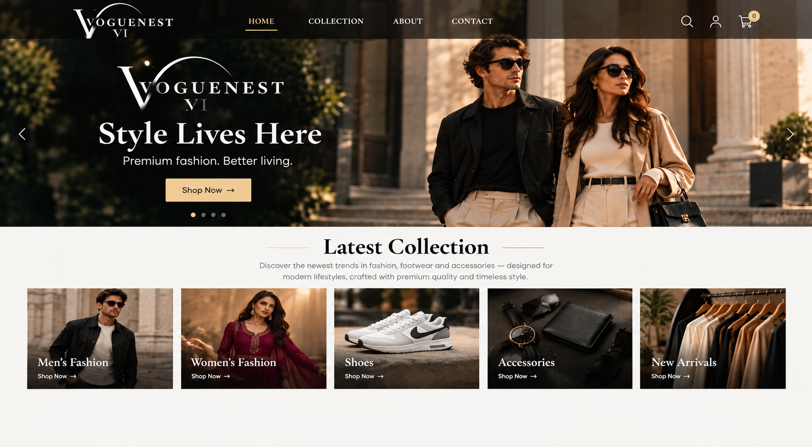
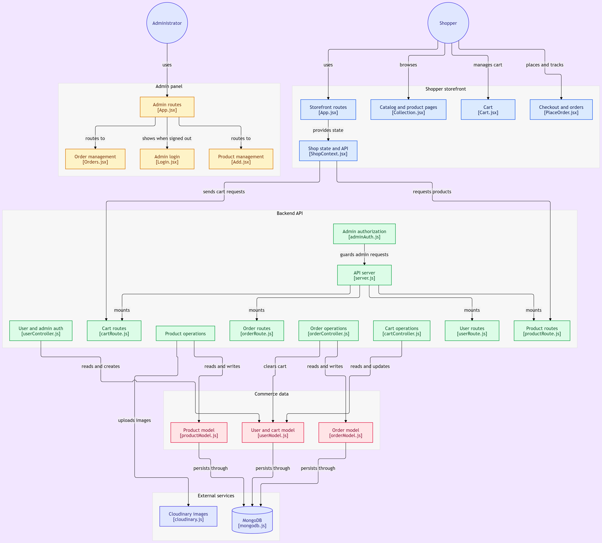

<p align="center" style="margin:0; padding:0;">
  <picture>
    <!-- Dark mode logo -->
    <source media="(prefers-color-scheme: dark)" srcset="project-frontend/public/logo-dark.png" />
    <!-- Light mode logo -->
    <source media="(prefers-color-scheme: light)" srcset="project-frontend/public/logo-light.png" />
    <!-- Fallback -->
    
  </picture>
</p>


<p align="center">
  <a href="https://react.dev/"></a>
  <a href="https://tailwindcss.com/"></a>
  <a href="https://nodejs.org/"></a>
  <a href="https://expressjs.com/"></a>
  <a href="https://www.mongodb.com/"></a>
  <a href="LICENSE"></a>
</p>



---

## 📖 Overview

**VougeNest** is a full-stack e-commerce web application designed around a
separated **shopper storefront** and **administrator dashboard**.

The application provides customers with a complete shopping workflow:

> Browse → Discover Products → Filter → View Product → Add to Cart → Checkout → Track Orders

At the same time, administrators have a dedicated management interface for:

> Admin Login → Product Management → Order Management

The platform follows a layered architecture where the React applications
communicate with a Node.js/Express backend API. The backend handles
authentication, authorization, business logic, database operations, and
image management.

---

## 🎯 Key Highlights

- 🛒 Full customer shopping experience
- 🔐 JWT-based authentication and authorization
- 👤 Separate customer and administrator workflows
- 🛠️ Dedicated admin dashboard
- 📦 Product creation and management
- 🧾 Order creation and order tracking
- 🛍️ Persistent shopping cart
- 🔎 Product browsing and filtering
- 🖼️ Cloudinary-based product image storage
- 🗄️ MongoDB database with Mongoose models
- 🌐 RESTful Express API
- ⚛️ React-based storefront and admin application
- 📱 Responsive user interface
- 🧩 Modular backend route/controller architecture

---


# 🏗️ System Architecture

VougeNest is organized into four major layers:

```text
┌───────────────────────────────┐
│       Shopper Frontend        │
│          React + UI           │
│                               │
│ Storefront │ Catalog │ Cart   │
│ Checkout   │ Orders  │ State  │
└───────────────┬───────────────┘
                │
                │ REST API
                ▼
┌───────────────────────────────┐
│         Backend API           │
│       Node.js + Express       │
│                               │
│ Authentication │ Routes       │
│ Controllers    │ Validation   │
│ Business Logic │ Authorization│
└───────────────┬───────────────┘
                │
        ┌───────┴────────┐
        │                │
        ▼                ▼
┌───────────────┐  ┌───────────────┐
│    MongoDB    │  │   Cloudinary  │
│               │  │               │
│ Products      │  │ Product       │
│ Users         │  │ Images        │
│ Carts         │  │               │
│ Orders        │  │               │
└───────────────┘  └───────────────┘
                ▲
                │
┌───────────────┴───────────────┐
│       Admin Frontend          │
│          React + UI           │
│                               │
│ Admin Login │ Products        │
│ Orders      │ Management      │
└───────────────────────────────┘
```
## 🏗️ Detailed Architecture Diagram

The following diagram illustrates the complete architecture of **VougeNest**, including the shopper storefront, admin panel, backend API, authentication and authorization layers, routes, controllers, Mongoose models, MongoDB, and Cloudinary.

<p align="center">
  
</p>

## 🧩 Application Architecture

```
                      ┌─────────────────────────────────┐
                      │          VougeNest System        │
                      └────────────────┬────────────────┘
                                       │
            ┌──────────────────────────┴──────────────────────────┐
            ▼                                                     ▼
┌───────────────────────┐                             ┌───────────────────────┐
│  Shopper Application  │                             │   Admin Application   │
│       (React)         │                             │       (React)         │
└───────────┬───────────┘                             └───────────┬───────────┘
            │                                                     │
            └──────────────────────────┬──────────────────────────┘
                                       │
                                       ▼
                       ┌───────────────────────────────┐
                       │      Backend API (Express)    │
                       └───────────────┬───────────────┘
                                       │
                                       ▼
                       ┌───────────────────────────────┐
                       │       Database (MongoDB)      │
                       └───────────────────────────────┘
```

---

## 👤 Shopper Application

The shopper-facing React application provides a seamless browsing and purchasing experience.

### Key Features & Capabilities
* **Storefront routes** & dynamic collection browsing
* **Product detail view** with real-time inventory and variation tracking
* **Advanced filtering** & dynamic product discovery
* **Persistent shopping cart** and streamlined checkout pipeline
* **Order history** & live status tracking
* **Authentication state management**

Primary state management and API communications are centralized within the **`ShopContext`**.

### Main Shopper Flow

```
Storefront Routes
   ├── Collection / Catalog
   ├── Product Pages
   ├── Cart
   └── Checkout & Orders
            │
            ▼
       ShopContext
            │
            ▼
       Backend API
```

---

## 🛠️ Admin Application

The administrator application is strictly isolated from the customer storefront to ensure security and clean operational separation.

Administrators can authenticate and access:

- 📦 Product management
- 🧾 Order management
- 🔐 Protected admin routes
- ➕ Product creation
- ✏️ Product management
- 👀 Order inspection

### Admin Route Flow

```
Admin Login
   │
   ▼
Admin Authentication
   │
   ▼
Admin Routes
   ├── ➕ Product Creation & Editing
   ├── ✏️ Product Catalog Management
   └── 👀 Order Inspection
```

> **Note:** Protected administrative requests are validated through the backend authorization layer before reaching any route or controller.

---

## ⚙️ Backend Architecture

The backend follows a classic layered architecture: **Route → Controller → Model Architecture**.

```
Client Request
      │
      ▼
Express Server
      │
      ├── 🔒 Authentication Middleware
      ├── 🛡️ Authorization Middleware
      └──  Routes
            │
            ▼
       Controllers
            │
            ▼
     Mongoose Models
            │
            ▼
     MongoDB Database
```

### Backend Responsibilities
- 🔑 User authentication & token management
- 🛡️ Role-based authorization (Admin / Customer)
- 📦 Product operations & catalog data handling
- 🛒 Cart persistence and state sync
- 🧾 Order generation, tracking, and status processing
- 👥 User profile management
- 🗄️ Database querying and persistence
- 🖼️ Image upload service integration
- ⚡ Request validation & standardized response formatting

---


## 🔐 Authentication & Authorization

VougeNest separates authentication from authorization.

### Customer Flow
```
Customer
   │
   ▼
Login / Authentication
   │
   ▼
JWT Token
   │
   ▼
Protected API Requests
   │
   ▼
User-specific resources
```
### Administrator Flow
```
Administrator
      │
      ▼
Admin Login
      │
      ▼
Authentication
      │
      ▼
Admin Authorization
      │
      ▼
Protected Admin API
```
The backend contains a dedicated authentication/authorization layer that
guards protected administrative requests.

## 🛒 Shopping Workflow

A typical customer session follows this flow:
```
Browse Products
      │
      ▼
Filter / Discover
      │
      ▼
Product Details
      │
      ▼
Add to Cart
      │
      ▼
Cart Management
      │
      ▼
Checkout
      │
      ▼
Create Order
      │
      ▼
Order History / Tracking
```
The cart is handled through the cart API and associated user data.

## 📦 Product Management Workflow

Administrators can create and manage products through the admin dashboard.
```
Admin Dashboard
      │
      ▼
Product Management
      │
      ▼
Product API
      │
      ▼
Product Controller
      │
      ├──────────────► Cloudinary
      │                 Product Images
      │
      ▼
Product Model
      │
      ▼
MongoDB
```
Product images are uploaded to Cloudinary, while product metadata and
references are persisted through MongoDB.

## 🧾 Order Management

Orders connect customers, cart information, and purchased products.

### Customer
```
Cart
 │
 ▼
Checkout
 │
 ▼
Order API
 │
 ▼
Order Controller
 │
 ▼
Order Model
 │
 ▼
MongoDB
```
### Administrator
```
Admin Dashboard
      │
      ▼
Order Management
      │
      ▼
Order API
      │
      ▼
Order Controller
      │
      ▼
MongoDB
```
This separation allows customer order creation and administrative order
management to use the same centralized backend.

## 🗄️ Data Layer

VougeNest uses MongoDB as its primary application database with
Mongoose providing schema modeling and database interaction.

### Core Models
```
Commerce Data
│
├── Product Model
│   └── productModel.js
│
├── User & Cart Model
│   └── userModel.js
│
└── Order Model
    └── orderModel.js
```
### Data Relationships
```
User
 │
 ├── Cart
 │
 └── Orders
       │
       └── Products

Product
 │
 └── Product Images
        │
        └── Cloudinary
```
## ☁️ External Services

### Cloudinary

Product images are handled using Cloudinary.

Benefits include:

- Centralized image hosting
- CDN delivery
- Image transformation capabilities
- Reduced database storage requirements

The database stores product information while image assets are handled
through Cloudinary.

## 📂 Project Structure
```
VougeNest/
│
├── project-frontend/
│   ├── public/
│   └── src/
│       ├── components/
│       ├── pages/
│       ├── context/
│       ├── hooks/
│       └── ...
│
├── admin-frontend/
│   ├── public/
│   └── src/
│       ├── components/
│       ├── pages/
│       ├── context/
│       └── ...
│
├── project-backend/
│   ├── controllers/
│   │   ├── orderController.js
│   │   ├── cartController.js
│   │   └── userController.js
│   │
│   ├── middleware/
│   │   └── adminAuth.js
│   │
│   ├── models/
│   │   ├── productModel.js
│   │   ├── userModel.js
│   │   └── orderModel.js
│   │
│   ├── routes/
│   │   ├── userRoute.js
│   │   ├── productRoute.js
│   │   ├── cartRoute.js
│   │   └── orderRoute.js
│   │
│   ├── config/
│   │   └── cloudinary.js
│   │
│   └── server.js
├── diagram.png
├── .gitignore
├── README.md
└── LICENSE
```
Directory names may vary slightly depending on the current implementation.
The structure above represents the application's architectural organization.

## ✨ Features
### 👤 Shopper Features
- 🏪 Browse the online storefront
- 🗂️ Explore product collections
- 🔎 Filter and discover products
- 📄 View product details
- 🛒 Add products to cart
- 🔄 Update cart contents
- 🔐 User authentication
- 💳 Checkout workflow
- 📦 Place orders
- 🧾 View previous orders
- 🚚 Track order information

### 🛠️ Administrator Features
- 🔐 Secure administrator login
- 🛡️ Protected admin routes
- ➕ Add products
- ✏️ Manage products
- 🖼️ Upload product images
- ☁️ Cloudinary image integration
- 📦 View customer orders
- 🧾 Manage order information

## 🛠️ Technology Stack

### 🎨 Frontend

| Technology | Purpose |
| :--- | :--- |
| **React** | User interface |
| **React Router** | Client-side routing |
| **TailwindCSS** | Styling |
| **Axios** | API communication |
| **Context API** | Application state |

### ⚙️ Backend

| Technology | Purpose |
| :--- | :--- |
| **Node.js** | Server runtime |
| **Express.js** | REST API framework |
| **JWT** | Authentication |
| **Mongoose** | MongoDB object modeling |
| **Multer** | File/image upload handling |
| **Cloudinary** | Image storage and delivery |

### 🗄️ Database & Infrastructure

| Technology | Purpose |
| :--- | :--- |
| **MongoDB** | Primary database |
| **Cloudinary** | Product image storage |
| **Git / GitHub** | Version control |

## 🚀 Getting Started

### 1. Clone the Repository
```bash
git clone https://github.com/your-username/VougeNest.git
cd VougeNest
```
### 2. Setup Backend

```
cd project-backend
npm install
```
Create a .env file:
```
MONGO_URI=mongodb://127.0.0.1:27017/vougenest
JWT_SECRET=your-secret-key
CLOUDINARY_URL=your-cloudinary-url
STRIPE_SECRET=your-stripe-secret
PORT=4000
```
Run the server:
```
nodemon server.js
```
### 3. Setup User Frontend
```
cd ../project-frontend
npm install
npm run dev
```
### 4. Setup Admin Panel
```
cd ../project-admin
npm install
npm run dev
```

## 📦 Scripts

### Backend
```
npm install
npm start
npm run dev
```
### Shopper Frontend
```
npm install
npm run dev
npm run build
npm run preview
```
### Admin Frontend
```
npm install
npm run dev
npm run build
npm run preview
```

## 🔌 API Architecture

The backend exposes REST-style endpoints grouped by resource.
```
/api
│
├── /user
│   └── Authentication & user operations
│
├── /product
│   └── Product operations
│
├── /cart
│   └── Cart operations
│
└── /order
    └── Order operations
```
The frontend applications communicate with these endpoints through HTTP
requests.

## 🔄 Request Lifecycle

A typical request flows through the application as follows:
```
React Frontend
      │
      ▼
Axios / HTTP Request
      │
      ▼
Express Server
      │
      ▼
Authentication / Authorization
      │
      ▼
    Route
      │
      ▼
  Controller
      │
      ▼
Mongoose Model
      │
      ▼
   MongoDB
      │
      ▼
Controller Response
      │
      ▼
  Express API
      │
      ▼
React Application
```
This separation keeps presentation, API routing, business operations, and
data persistence organized into independent layers.

## 🔒 Security

VogueNest implements several application-level security mechanisms:

- **JWT-based authentication**
- **Protected customer operations**
- **Protected administrator operations**
- **Role-aware authorization**
- **Environment-based secret configuration**
- **Server-side API validation**
- **Separation between frontend and backend credentials**
- **Sensitive configuration excluded through `.gitignore`**

> **Production Recommendation:** Production deployments should additionally use HTTPS, secure cookie/token strategies where appropriate, input validation, rate limiting, secure headers, and properly managed production secrets.

---

## 🧪 Development Workflow

Recommended development flow:
```
1. Start MongoDB
       ↓
2. Start Backend API
       ↓
3. Start Shopper Frontend
       ↓
4. Start Admin Frontend
       ↓
5. Test Authentication
       ↓
6. Test Product Operations
       ↓
7. Test Cart & Checkout
       ↓
8. Test Order Management
```

## 📊 Architecture at a Glance

| Layer | Main Responsibility | Technologies |
| :--- | :--- | :--- |
| **Shopper UI** | Customer shopping experience | React, TailwindCSS |
| **Admin UI** | Product & order administration | React, TailwindCSS |
| **State Layer** | Client-side application state | React Context |
| **API Layer** | HTTP communication | Axios |
| **Server** | Application/API logic | Node.js, Express |
| **Auth** | Authentication & authorization | JWT |
| **Controllers** | Business operations | Express Controllers |
| **Data Models** | Database abstraction | Mongoose |
| **Database** | Persistent application data | MongoDB |
| **Media** | Product image storage | Cloudinary |

---

## 📌 Roadmap

Planned improvements include:

- [ ] Product reviews and ratings
- [ ] Wishlist functionality
- [ ] Advanced admin analytics
- [ ] Sales and revenue dashboard
- [ ] Product inventory management
- [ ] Low-stock notifications
- [ ] Multiple administrator roles
- [ ] Delivery/fulfillment role
- [ ] Advanced order status workflow
- [ ] Improved product search
- [ ] Recommendation system
- [ ] Notification system
- [ ] Enhanced mobile experience
- [ ] Automated testing
- [ ] Production deployment
- [ ] CI/CD pipeline

## 🚀 Future Architecture

The application can be extended toward a more scalable architecture:
```
                         ┌───────────────┐
                         │ Shopper App   │
                         └───────┬───────┘
                                 │
                         ┌───────▼───────┐
                         │   API Layer   │
                         └───────┬───────┘
                                 │
              ┌──────────────────┼──────────────────┐
              │                  │                  │
       ┌──────▼──────┐    ┌──────▼──────┐    ┌──────▼──────┐
       │ Auth        │    │ Products    │    │ Orders      │
       │ Service     │    │ Service     │    │ Service     │
       └──────┬──────┘    └──────┬──────┘    └──────┬──────┘
              │                  │                  │
              └──────────────────┼──────────────────┘
                                 │
                         ┌───────▼───────┐
                         │   MongoDB     │
                         └───────────────┘
                                 │
                         ┌───────▼───────┐
                         │  Cloudinary   │
                         └───────────────┘
```
The current modular route/controller/model structure provides a foundation
for introducing additional services and capabilities as the application
grows.
  

## 🤝 Contributing

Contributions are welcome.

1. Fork the repository
```
git fork
```
2. Create a feature branch
```
git checkout -b feature/your-feature-name
```
3. Make your changes
Implement and test your feature.
4. Commit your changes
```
git add.
git commit -m "Add: your feature description"
```
5. Push your branch
```
git push origin feature/your-feature-name
```
6. Open a Pull Request

Describe the changes and include relevant screenshots or testing information.

## 🐛 Issues & Feature Requests

If you discover a bug or have an idea for improving VougeNest, please open a
GitHub issue.

## 👨‍💻 Author
<div align="center">
MD Sifat Ahammed Akash

Full-Stack Developer | Computer Science & Engineering

📧 Email: sifatahammed821@gmail.com

</div>
## 📄 License
<div align="center">

MIT License © MD Sifat Ahammed Akash

<div align="center">
⭐ If you find VougeNest useful, consider giving the repository a star!

Built with ❤️ using React, Node.js, Express, MongoDB, and Cloudinary.

 </div> 
